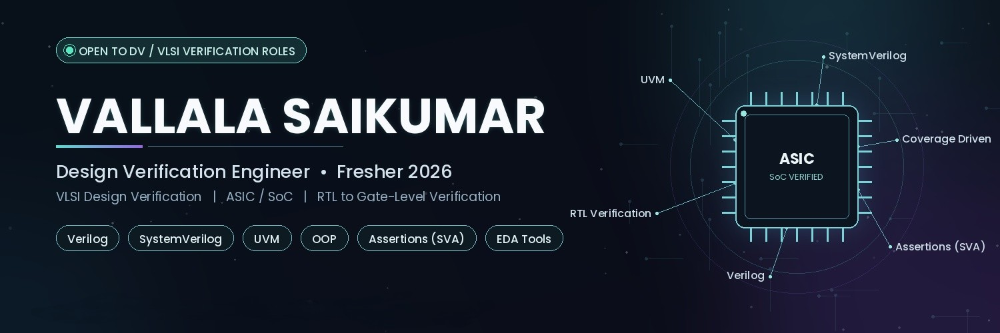

<div align="center">



 Hi, I'm Vallala Saikumar

### 🚀 Design Verification Engineer | VLSI | SystemVerilog | UVM | ASIC Verification

<p>


</p>

<a href="resume.pdf">

</a>

</div>

---

#  About Me

<table>

<tr>

<td width="55%">

```yaml
Name        : Vallala Saikumar

Role        : Design Verification Engineer

Education   : B.Tech Electronics & Communication

CGPA        : 8.32

Institute   : Vaagdevi Engineering College

Location    : Telangana, India

Speciality  :
  - Functional Verification
  - UVM
  - SystemVerilog
  - RTL Verification
  - Assertions
  - Functional Coverage
```

### 💡 Current Focus

- Advanced UVM
- AXI Verification
- Assertion Based Verification
- Coverage Driven Verification
- Design Verification Interview Preparation

</td>

<td>


</td>

</tr>

</table>

---

# 🌐 Connect With Me

<p align="center">

<a href="mailto:vallalasaikumar6@gmail.com">

</a>

<a href="https://linkedin.com/in/vallalasaikumar">

</a>

<a href="https://github.com/vallala-saikumar">

</a>

</p>

---

# 🏆 Competitive Programming

| Platform | Status |
|----------|---------|
| HackerRank | Digital Design |
| GeeksForGeeks | Interview Preparation |

---

# 💻 Skills

### HDL

<p>


</p>

- Verilog
- SystemVerilog
- UVM
- SVA
- TCL

---

### Verification

- Functional Verification
- UVM
- Assertions
- Functional Coverage
- Constrained Random Verification
- Scoreboard
- Monitor
- Driver
- Sequence
- Sequencer
- Agent
- Environment
- Factory Override
- Config DB

---

### Digital Design

- FSM
- UART
- I2C
- RTL Design
- Testbench
- ASIC Flow

---

# ⚙ Tech Stack

<p align="center">


</p>

| Category | Tools |
|------------|----------------|
| HDL | Verilog, SystemVerilog |
| Verification | UVM, Assertions |
| Simulator | QuestaSim |
| FPGA | Vivado, Xilinx ISE |
| Version Control | Git, GitHub |
| Scripting | TCL |

---

# 🚀 Featured Projects

## 🔷 UART Design & Functional Verification

✔ RTL Design

✔ Layered Testbench

✔ Functional Coverage

✔ Assertions

✔ Waveform Debugging

**Tech**

```
Verilog
SystemVerilog
UART
QuestaSim
Coverage
SVA
```

---

## 🔷 I2C Master Controller

✔ START / STOP

✔ ACK / NACK

✔ Read Write

✔ FSM

✔ Testbench

**Tech**

```
Verilog
I2C
RTL
Simulation
Verification
```

---

# 💼 Experience

### Design Verification Trainee

**VLSI FIRST**

📍 Hyderabad

**Responsibilities**

- RTL Verification
- Functional Coverage
- Assertions
- QuestaSim Debugging
- Constrained Random Verification
- Verification Planning

---

# 🏅 Achievements

🥇 1st Place - Electronics Technical Quiz

🎓 Front End Design Internship

📘 Design Verification Trainee

🚀 Multiple RTL Verification Projects

---

# 📊 GitHub Analytics

<div align="center">


</div>

---

# 📈 Contribution Graph

<p align="center">


</p>

---

# 🌟 GitHub Trophies

<p align="center">


</p>

---

# 🌍 Open Source

I enjoy contributing to

- Verification IP
- SystemVerilog Libraries
- UVM Utilities
- Verification Automation
- Digital Design Examples

---

# 📫 Contact

<div align="center">

### Let's build the future of silicon together.

<a href="mailto:vallalasaikumar6@gmail.com">

</a>

<a href="https://linkedin.com/in/vallalasaikumar">

</a>

<a href="https://github.com/vallala-saikumar">

</a>

</div>

---

<div align="center">

### ⭐ Thanks for visiting my profile ⭐


</div>

